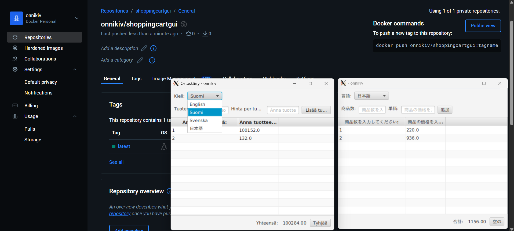
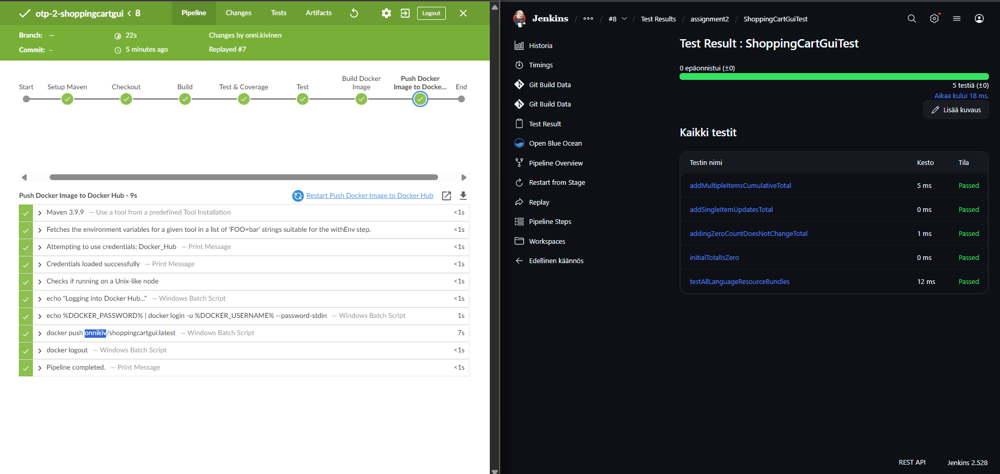
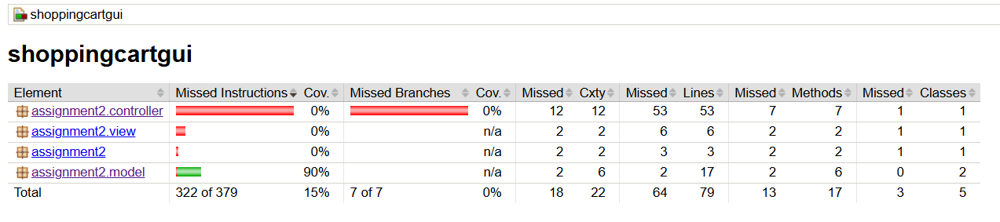
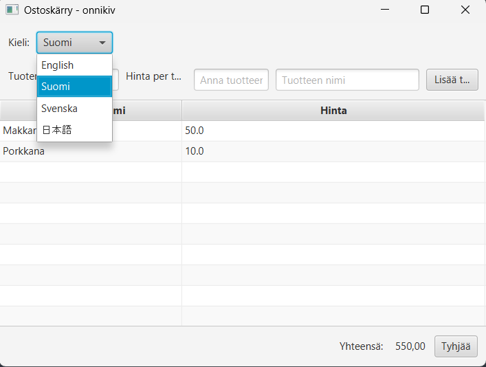
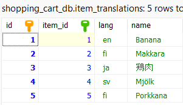
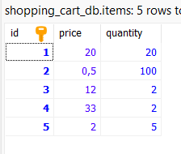
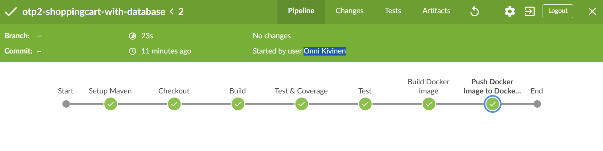
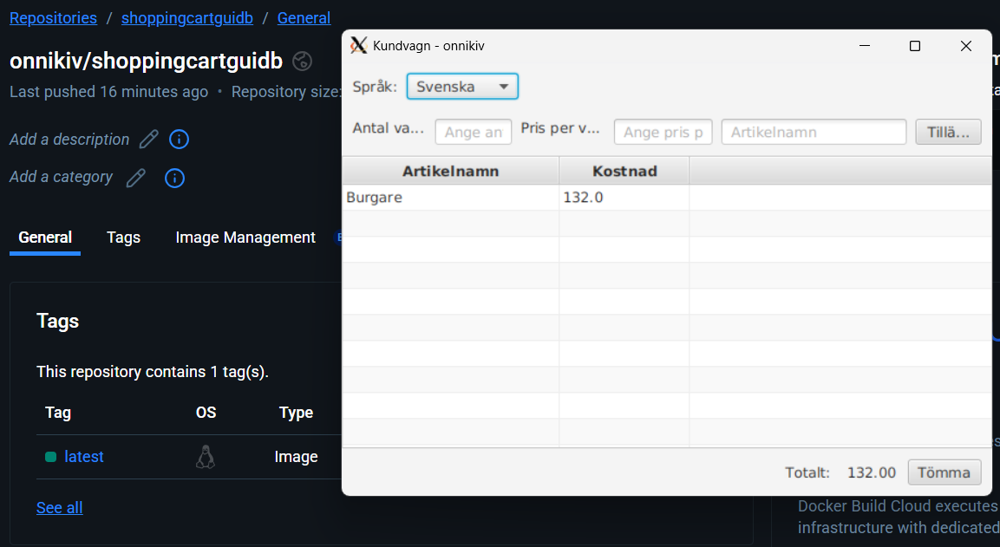

# ohjelmistotuotantoprojekti-2-TX00EY30-3007

## Inclass Assignment 1 - Shoppingcart in console

[Play with docker](https://labs.play-with-docker.com/)

```cmd
docker pull onnikiv/shoppingcart:latest
```

```cmd
docker run --rm -it onnikiv/shoppingcart:latest
```

## Inclass Assignment 2 - Shoppingcart with GUI





## Inclass Assignment 3 - JavaFX Shopping Cart with DATABASE Localization







## Inclass Assignment 4 - Calculator with SonarQube

```cmd
cd .\sonarcalculator\
sonar-scanner
```
