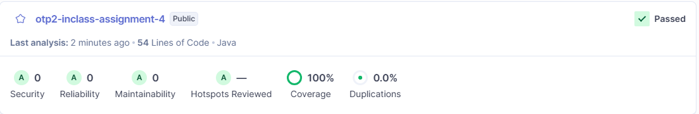
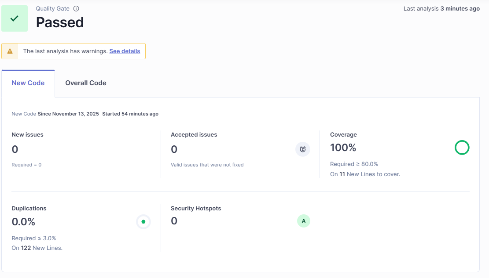
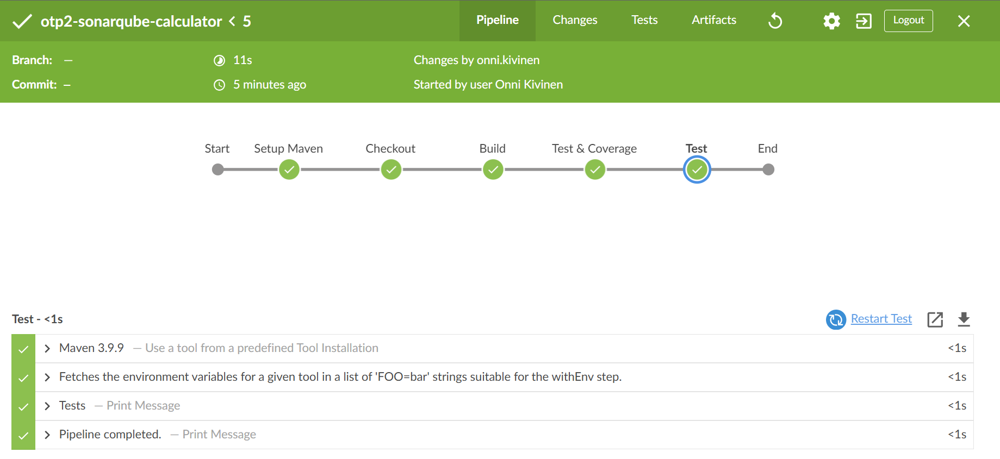
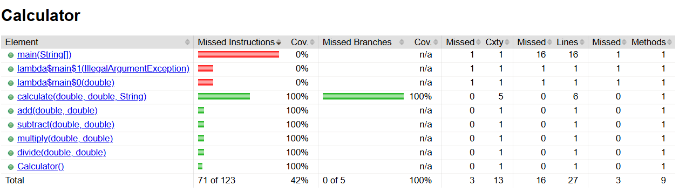
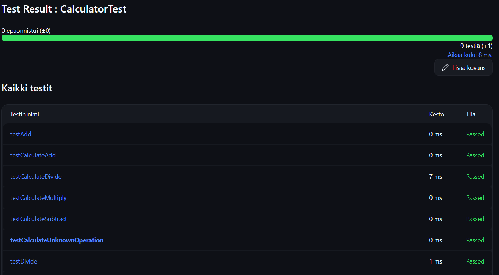

# Inclass Assignment 4 - Calculator with SonarQube

[https://github.com/onnikiv/ohjelmistotuotantoprojekti-2-TX00EY30-3007/tree/main](https://github.com/onnikiv/ohjelmistotuotantoprojekti-2-TX00EY30-3007/tree/main)

The code for this **inclass assignment 4** is located in the `/sonarcalculator`

