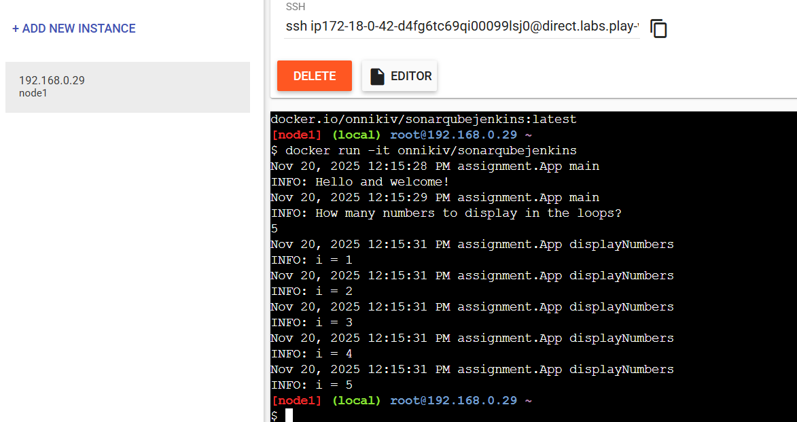
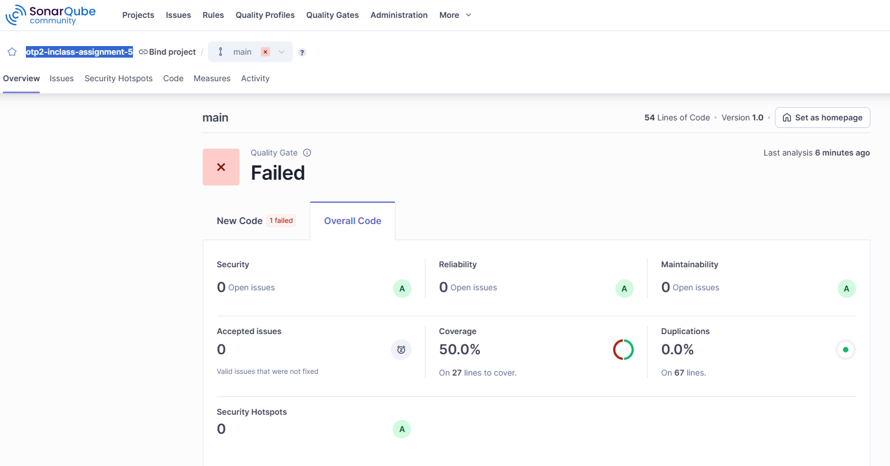

# Inclass Assignment 5 - SonarQube through Jenkins pipeline

[https://github.com/onnikiv/ohjelmistotuotantoprojekti-2-TX00EY30-3007/tree/main](https://github.com/onnikiv/ohjelmistotuotantoprojekti-2-TX00EY30-3007/tree/main)

The code for this **inclass assignment 5** is located in the `/sonarqubejenkins`

